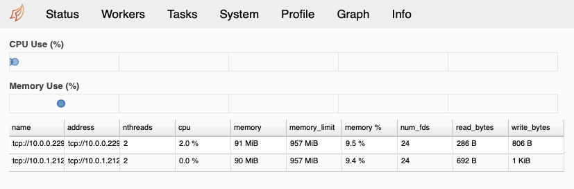
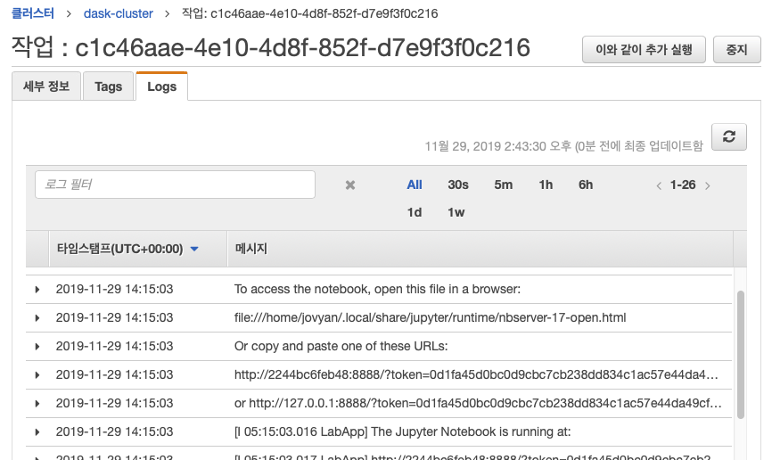
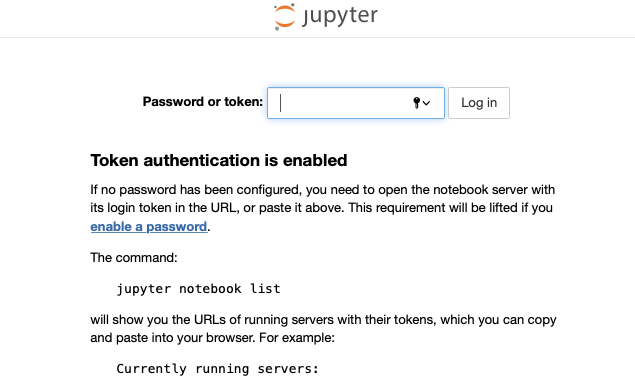
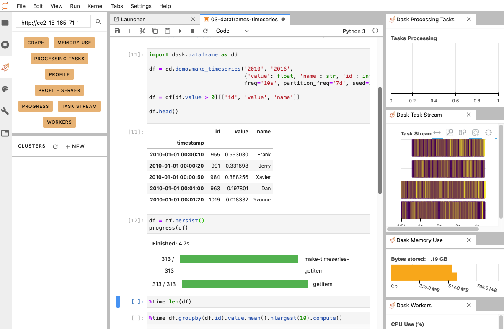

## 소개

Dask를 이용하면 대용량 데이터를 굳이 Spark을 사용하지 않고, 더 파이썬스럽게 처리할 수 있다. 일반적인 데이터에서는 로컬 PC에서 Dask 클러스터를
띄우는 것으로도 충분한 도움을 받을 수 있으나, 대용량 데이터나 특성을 다루기에는 부족할 수 있다.

나는 비용 최적화를 위해, 다음과 같은 작업 방식을 가정하겠다:

* 일반적으로 로컬 PC에서 Jupyter 노트북과 Dask 클러스터를 띄워 작업하다가,
* 많은 데이터를 다루거나 특성 발굴 작업이 필요한 경우, 사용하는 환경 그대로 클라우드에 Dask 클러스터를 띄워서 사용한다.

위와 같은 설정에서, 로컬 PC에서 사용하는 분석 환경과 클러스터의 환경이 같도록 하기 위해 도커를 사용하는 것이 바람직하겠다:

* 사용하는 Jupyter 노트북 환경을 도커 이미지로 만들고, 로컬 PC 작업시에도 이것을 이용한다.
* 대용량 데이터 처리시 클라우드에 이 도커 이미지로 클러스터를 구성하여 작업을 수행한다.

Dask 클러스터는 Kubernetes나 Yarn을 활용해서도 만들수 있는데, 여기서는 [AWS ECS(Elastic Container Service)](https://aws.amazon.com/ko/ecs/)를 사용하겠다. ECS를 사용하는 이유는 비교적 설정이 간단하며, 고정 클러스터 비용이 들지 않는다는 점 때문이다.

### 먼저 필요한 것

* AWS 계정
* 생성된 VM에 로그인하기 위한 IAM 키페어
* [AWS 명령줄 인터페이스](https://aws.amazon.com/ko/cli/)
* [도커](https://www.docker.com)

**주의: 지나친 AWS 과금 발생하지 않도록 적절한 리소스를 사용하고, 사용하지 않는 것은 꼭 제거해주자!**

## 도커 이미지 저장소 준비

다음과 같은 세 가지 도커 이미지를 만들고 저장소에 올려야한다.

* Dask 스케쥴러 이미지
* Dask 워커 이미지
* 분석 노트북 이미지

저장소는 AWS ECR을 이용하겠다. 다음처럼 도커 클라이언트를 ECR에 인증받아 둔다.

    $(aws ecr get-login --no-include-email --region ap-northeast-2)

먼저 스케쥴러를 위한 저장소를 만들어 보자. AWS ECS 대쉬보드로 가서 `리포지토리 생성`의 `시작하기`를 누른다.


리포지토리 이름에서 `dask-scheduler`를 입력한 후 `리포지토리 생성`을 누른다.


다음과 같이 저장소 생성을 확인할 수 있다.


스케쥴러의 저장소 주소(URI)를 복사해두자.

위와 같은 식으로 `dask-worker` 및 `dask-notebook` 저장소도 각각 만들고 주소를 기록해 둔다.

완료되면 ECR 대쉬보드에서 다음과 같이 확인할 수 있다.


## 도커 이미지를 만들고 저장소에 올리기

적당한 작업 디렉토리에서, 각각을 위해 다음과 같이 하위 디렉토리를 만들자.

```
$ mkdir scheduler/
$ mkdir worker/
$ mkdir notebook/
```

다음과 같은 내용으로 워커와 노트북에서 사용할 빌드 스크립트 `build.sh`를 만든다.

```sh
#!/usr/bin/env bash
set -e
apt-get update
apt-get -y install build-essential
echo "Getting Python packages..."
pip install -U --no-cache-dir -r requirements.txt
rm requirements.txt
echo "Done!"
```

`requirements.txt`에는 워커와 노트북에서 추가적으로 설치할 `pip` 패키지가 기술된다. 다음과 같이 작성한다.

```
dask-ml
```

완성된 작업 디렉토리는 다음과 같이 보일 것이다.

```
-rw-r--r--  1 haje01  staff   194B 11 28 15:02 build.sh
drwxr-xr-x  2 haje01  staff    64B 11 28 15:01 notebook
-rw-r--r--  1 haje01  staff     7B 11 28 15:06 requirements.txt
drwxr-xr-x  2 haje01  staff    64B 11 28 15:01 scheduler
drwxr-xr-x  2 haje01  staff    64B 11 28 15:01 worker
```

### Dask 스케쥴러 이미지
먼저 `scheduler` 디렉토리에서, 다음과 같은 내용으로 `Dockerfile`을 만들자.

```dockerfile
# 기본 이미지
FROM daskdev/dask

# host의 hostname을 얻기 위해
RUN apt-get install -y curl

# 시작 스크립트를 컨테이너에 복사
COPY scheduler/start.sh ./

# Dask 스케쥴러가 사용할 두 포트를 노출한다.
EXPOSE 8786
EXPOSE 8787

# 시작 스크립트 실행
CMD ["sh","start.sh"]
```

다음과 같은 내용으로 시작 스크립트 `start.sh`를 만든다.

```sh
#!/bin/bash

# 인스턴스 메타데이터에서 스케쥴러의 호스트명을 얻어 EFS에 파일로 기록
HOST_HOSTNAME=$(curl http://169.254.169.254/latest/meta-data/hostname)
echo "Setting scheduler hostname to $HOST_HOSTNAME"
echo $HOST_HOSTNAME > /data/.scheduler

# 스케쥴러 시작
echo "Starting Dask Scheduler..."
dask-scheduler
```

이제 작업 폴더에서, 다음처럼 스케쥴러의 도커 이미지를 만들고,

    $ docker build -t dask-scheduler -f scheduler/Dockerfile .

이미지를 태깅한 후,

    $ docker tag dask-scheduler:latest [스케쥴러 저장소 주소]:latest

저장소에 올린다.

    $ docker push [스케쥴러 저장소 주소]:latest


### Dask 워커 이미지

이제 `worker` 디렉토리에서, 다음과 같은 내용의 `Dockerfile`을 만든다.

```dockerfile
# 기본 이미지
FROM daskdev/dask

# root 유저 사용
USER root

# 의존파일 컨테이너에 복사
COPY requirements.txt build.sh worker/start.sh ./
RUN sh build.sh
RUN rm build.sh

# 실행 명령
CMD ["sh", "start.sh"]
```

다음과 같은 내용으로 시작 스크립트 `start.sh`를 만든다.

```sh
#!/bin/bash

# EFS 파일에서 스케쥴러 이름을 구함
scheduler=$(cat /data/.scheduler)
echo "Setting scheduler hostname to $scheduler"

# 워커 시작
echo "Starting Dask worker..."
dask-worker --worker-port 8000 tcp://$scheduler:8786
```

이제 작업 폴더에서, 다음처럼 워커의 도커 이미지를 만들고,

    $ docker build -t dask-worker -f worker/Dockerfile .

이미지를 태깅한 후,

    $ docker tag dask-worker:latest [워커 저장소 주소]:latest

저장소에 올린다.

    $ docker push [워커 저장소 주소]:latest


### Jupyter 노트북 이미지

이제 `notebook` 디렉토리에서, 다음과 같은 내용의 `Dockerfile`을 만든다.

```dockerfile
# 기본 이미지
FROM daskdev/dask-notebook

# root 유저 사용
USER root

# 의존파일 컨테이너에 복사
COPY requirements.txt build.sh ./
# 노트북 시작 스크립트 복사
COPY notebook/start.sh /opt/app/start-notebook.sh

RUN sh build.sh
RUN rm build.sh
EXPOSE 8888

# 실행 명령
CMD ["sh","/opt/app/start-notebook.sh"]
```

다음과 같은 내용으로 시작 스크립트 `start.sh`를 만든다.

```sh
#!/bin/bash

# EFS 파일에서 스케쥴러 이름을 구해 Dask 환경변수에 설정
scheduler=$(cat /data/.scheduler)
echo "Setting scheduler name to $scheduler"
export DASK_SCHEDULER_ADDRESS="tcp://$scheduler:8786"

# 노트북 서버 시작
start.sh jupyter lab
```

이제 작업 폴더에서 다음처럼 노트북의 도커 이미지를 만들고,

    $ docker build -t dask-notebook -f notebook/Dockerfile .

이미지를 태깅한 후,

    $ docker tag dask-notebook:latest [노트북 저장소 주소]:latest

저장소에 올린다.

    $ docker push [노트북 저장소 주소]:latest

이제 모든 도커 이미지가 준비되었다. ECR 대쉬보드에서 각 리포지토리를 선택하면 이미지 태그와 URI를 확인할 수 있다.


## ECS 클러스터 만들기

AWS ECS는 관리형인 `Fargate`를 이용하거나, `EC2`를 그대로 이용하는 두 가지 방식으로 사용할 수 있다. `Fargate`는 편리하나 비용이 좀 더 나오기에, 여기서는 `EC2`를 사용한다. 아래는 AWS ECS 대쉬보드 시작화면이다.


여기에서 `시작하기`를 누르면 Fargate를 사용하는 클러스터 생성 화면으로 이동하기에 그것을 누르지 말고, 좌측 상단의 `클러스터`를 클릭하도록 하자. 그다음 화면에서 `클러스터 생성`을 누른다.


다음 `클러스터 템플릿 선택` 화면에서, `EC2 Linux + 네트워킹` 화면을 누른다.


다음 `클러스터 생성` 화면에서 다음과 같이 설정한다.


* `클러스터 이름`은 `dask-cluster`로
* `EC2 인스턴스 유형`은 `t3.micro`(2 vCPU, 1 GiB 메모리)로.
* `인스턴스 개수`도 필요에 맞게 (스케쥴러, 하나 이상의 워커, 그리고 노트북의 최소 3개이상 필요, 예에서는 `4`개)
* `키 페어`는 SSH 접속에 사용할 IAM 키페어

ECS를 통해 생성된 VM들에는 `ECS 컨테이너 에이전트`라는 프로그램이 설치된다. 이것은 사용자를 대신해 서비스 운용에 필요한 ECS API를 호출한다. 이를 위해서 VM의 컨테이너 인스턴스에 `ecsInstanceRole` IAM 정책과 역할이 필요하다.

아래쪽에 보면 `컨테이너 인스턴스 IAM 역할` 섹션이 있는데, 기존에 생성된 `ecsInstanceRole`이 있으면 자동으로 그것이 선택되어 있고, 아니면 자동으로 생성되도록 설정된다.


나머지는 기본값을 이용하고, 익숙해진 뒤 필요에 따라서 설정해보자. 이제 `생성` 버튼을 누르면 클러스터가 만들어진다. 클러스터 생성이 완료되면, `클러스터 보기`를 눌러 만들어진 클러스터를 확인할 수 있다.

컨테이너 인스턴스(VM) 생성에는 시간이 걸린다. 좀 기다리면 원래 명시한 개수의 VM이 생성된 것을 확인할 수 있다.


### VM의 네트워크 설정

생성된 EC2 인스턴스들 중 하나를 클릭하면, 해당 VM의 EC2 대쉬보드로 이동한다. 여기에서 아래에 있는 `보안 그룹`을 클릭하여 네트워크 설정을 할 수 있다. 보안 그룹 화면에서 `인바운드` 탭을 누르고, `편집`을 눌러 다음과 같이 수정한다.

* 기본 생성된 80포트 규칙을 제거
* `규칙 추가`를 눌러 다음과 같은 포트들을 추가


  * `사용자 지정 TCP` 유형 `TCP` 프로토콜 `22` 포트범위 `내 IP` 소스 - SSH 접속용
  * `사용자 지정 TCP` 유형 `TCP` 프로토콜 `8888` 포트범위 `내 IP` 소스 - Jupyter 노트북용
    * `사용자 지정 TCP` 유형 `TCP` 프로토콜 `8786-8789` 포트범위 `내 IP` 소스 - Dask 스케쥴러 및 진단용
  * `모든 TCP` 유형 `TCP` 프로토콜 - Dask 워커용

마지막의 `모든 TCP` 유형은 클러스터 내부 워커들간 통신을 위한 것으로, `CIDR, IP 또는 보안 그룹`을 클릭한 후 `EC2`를 입력해 나오는 `dask-cluster` 관련 보안 그룹을 선택하면 된다.

설정 후 저장을 누르면 된다. 클러스터내 VM들은 같은 보안 그룹을 공유하기에 한 번만 설정해주면 된다.

다음으로 넘어가기 전에, 보안 그룹 화면의 `설명` 탭에서 `VPC ID`를 기억해 둔다. EFS 생성에 필요하다.

### EFS 만들기

[AWS EFS(Elastic File System)](https://aws.amazon.com/ko/efs/)는 클라우드 파일시스템으로 다음과 같은 용도로 필요하다.

* 워커들간 같은 데이터 파일 공유
* Dask 스케쥴러의 주소를 워커들에 공유

AWS EFS 대쉬보드로 가서 `파일 시스템 생성`을 누른다.


아까 기억해둔 VPC를 선택하고, `탑재 대상 생성` 섹션에 있는 모든 항목에 대해 `보안 그룹`을 제거 후, `EC2`를 눌러 나오는 `dask-cluster` 관련 보안 그룹을 선택한다. 완료되면 `다음 단계`를 누른다. `선택적 설정 구성` 화면이 나오는데, 기본값 그대로 넘어간 후, `파일 시스템 생성`을 누른다.

완료 후 다음과 같은 화면에서 `DNS 이름`을 복사해 둔다.


### VM 부팅시 EFS를 사용하도록 설정

만들어진 EFS 파일 시스템을 VM 부팅시 마운트 되도록 설정이 필요하다. EC2 대쉬보드 왼쪽 메뉴에서 `시작 구성`을 누른다.


ECS 클러스터 생성시 만들어진 시작 구성이 하나 있다. 이것을 선택 후 `작업`을 누르고 `시작 구성 복사`를 누른다. 다음 화면에서 제일 위의 단계 링크 중 `3. 세부 정보 구성`을 누른 후 다음처럼 설정한다.

* 이름을 `EC2ContainerService-dask-cluster-EFS`로 바꾼다.
* IAM 역할을 `ecsInstanceRole`로 선택
* `고급 세부 정보`를 눌러 `User data` 란에 아래 텍스트의 `[EFS DNS 이름]`을 보사해둔 것으로 바꾸고, `[ECS 클러스터 이름]`을 `dask-cluster`로 바꾸어 기재한다.

```
Content-Type: multipart/mixed; boundary="==BOUNDARY=="
MIME-Version: 1.0

--==BOUNDARY==
Content-Type: text/cloud-boothook; charset="us-ascii"

# Install nfs-utils
cloud-init-per once yum_update yum update -y
cloud-init-per once install_nfs_utils yum install -y nfs-utils

# Create /efs folder
cloud-init-per once mkdir_efs mkdir /efs

# Mount /efs
cloud-init-per once mount_efs echo -e '[EFS DNS 이름]:/ /efs nfs4 nfsvers=4.1,rsize=1048576,wsize=1048576,hard,timeo=600,retrans=2 0 0' >> /etc/fstab
mount -a

--==BOUNDARY==
Content-Type: text/x-shellscript; charset="us-ascii"

#!/bin/bash
echo ECS_CLUSTER=[ECS 클러스터 이름] >> /etc/ecs/ecs.config
echo ECS_BACKEND_HOST= >> /etc/ecs/ecs.config
--==BOUNDARY==--
```


설정이 끝난 후 `검토로 이동`을 누르고 `시작 구성 생성`을 누르면 키페어 선택화면이 나오는데, 사용할 IAM 키페어를 선택 후 `시작 구성 생성`을 누른다.

이제 생성된 EFS를 사용하는 시작 구성을 오토 스케일링 그룹에 설정해 주어야 한다. EC2 대쉬보드로 가서, 왼쪽 메뉴의 `Auto Scaling 그룹`을 누른다. ECS 클러스터 생성시 만들어진 오토 스케일링 그룹이 하나 보이는데, 이것을 선택하고 `작업`에서 `편집`을 누른다.


`시작 구성`을 새로 생성한 `EC2ContainerService-dask-cluster-EFS`로 바꾼다. 필요한 경우 이 화면에서 `Dask 워커 수 + 2(스케쥴러 + 노트북)`로 인스턴스 수를 변경할 수 있다. 일단 `저장`을 눌러 종료한다.

바뀐 시작 설정은 VM이 새로 뜰때 반영되기에, EC2 대쉬보드로 가서 기존 VM들은 모두 종료 시켜준다.


모든 VM이 종료된 후, 잠시 기다리면 오토 스케일링에 의해 새로운 VM들이 생성되는 것을 확인할 수 있다.

특정 VM에 SSH로 들어가 보면 제대로 생성되었는지 확인할 수 있다. 클러스터의 `ECS 인스턴스` 탭에서 EC2 인서턴스를 하나 선택하고, 해당 VM의 `IPv4 퍼블릭 IP`를 복사한 후

    $ ssh -i [키페어 PEM 파일경로] ec2-user@[퍼블릭 IP]

로 들어가사

    $ ls -alh / | grep efs

로 `efs` 디렉토리가 확인되면 잘 생성된 것이다. 워커에 필요한 공용 데이터가 있으면 `scp` 등을 이용해 이곳에 올리면 되겠다.

## ECS 작업 및 서비스 만들기

지금까지 작업은 컨테이너를 띄울 수 있는 인스턴스(VM)을 만드는 과정이었다. 이제 실제로 컨테이너를 띄워보자. 여기에는 작업 정의, 작업, 서비스에 대한 이해가 필요하다.

* `작업 정의(Task Definition)` - 컨테이너 설정의 집합이다. 작업에 따라 하나 이상의 컨테이너를 필요로 할 수 있다.
  * 어떤 도커 이미지를 사용할 것인가?
  * 어떤 포트를 노출할 것인가?
  * CPU와 메모리를 얼마나 사용할 것인가?
  * 로그를 어떻게 수집할 것인가?
  * 기타 환경 변수 등
* `작업(Task)`
  * 작업은 작업 정의를 실행할 때 생긴다.
  * (하나 또는 그 이상의)컨테이너를 띄우고, 정지 또는 종료되었을 때 자동으로 교체되지 않는다.
  * 작업의 직접 실행은 CRON 등을 통해 짧은 일을 시킬 때 사용된다.
* `서비스(Service)`
  * 서비스는 작업들이 항상 실행되는 것을 보장한다.
  * 만약 에러나 EC2 인스턴스의 문제로 작업의 컨테이너가 종료되면, 서비스는 그 작업을 교체한다.
  * 클러스터를 만드는 이유는 CPU나 메모리, 네트웍 측면에서 서비스에 충분한 리소스를 공급하기 위함이다.
  * 서비스는 작업 정의를 참고해 작업을 생성하는 책임을 진다.
  * 서비스는 웹서버처럼 오랫동안 동작하는 어플리케이션을 위한 것이다.
  * 고가용성을 위한 Multi-AZ 설정이 가능하다.


### 작업 정의

먼저 스케쥴러 작업을 만들어보자.

#### 스케쥴러 작업 정의

ECS 대쉬보드 왼쪽 메뉴의 `작업 정의`를 누르고, `새 작업 정의 생성`을 누른다.


`시작 유형 호환성 선택`에서 `EC2`를 선택 후 `다음 단계`를 누른다. `작업 및 컨테이너 정의 구성` 에서 `작업 정의 이름`을 `dask-scheduler`로 기입하고, `네트워크 모드`를 `호스트`로 선택한다.


아래쪽 `볼륨` 섹션의 `볼륨 추가`를 눌러 `이름`은 `efs-data`, `소스 경로`는 `/efs`로 입력 후 `추가`를 누른다. 이렇게 하면 호스트(컨테이너 인스턴스)의 `/efs/` 디렉토리를 볼륨으로 참조할 수 있다.


이제 위쪽의 `컨테이너 추가`를 누른다. `컨테이너 이름`에 `dask-scheduler`를, `이미지 이름`에는 스케쥴러의 저장소 이미지 URI를 입력한다. 다음으로, `메모리 제한(MiB)`를 `소프트 제한`에 `700`으로 설정한다. `포트 매핑`에서 `8786`, `8787`을 추가한다.


아래쪽의 `스토리지 및 로깅` 섹션으로 이동해, `탑재 지점`에서 아까 만들어둔 `efs-data`를 선택하고, 아래에  `/data`를 기입한다. 끝으로 `로그 구성`에서 `Auto-configure CloudWatch Logs`를 체크한 후 `추가`를 눌러 컨테이너를 추가한다. 이제 `생성`을 눌러 `새 작업 정의 생성`을 마친다.


생성된 작업 정의는 해당 이름의 작업 안에 `dask-scheduler:1`이 형식으로 보이는데 끝의 숫자는 버전을 나타낸다. 수정할 때마다 하나씩 올라간다. 이제 `dask-scheduler` 이미지를 실행할 수 있는 작업 템플릿을 가졌다. 실제 실행을 위해서는 `ECS 서비스`를 만들어야 한다.

####  스케쥴러 서비스 생성

작업 정의 화면에서 `dask-scheduler`를 선택하고 `작업`의 `서비스 생성`을 누른다.


다음의 `서비스 구성` 화면의 `시작 유형`에서 `EC2`를 선택하고, `서비스 이름`에서 `dask-scheduler`를 `작업 개수`에 `1`을 입력한다.


 `작업 배치` 섹션의 `배치 템플릿`에서 `호스팅당 작업 한 개`를 선택한다.

 

 `다음 단계`를 눌러 나오는 화면에서, 다른 것들은 그대로 두고 `서비스 검색 통합 활성화`만 체크를 해제한다.

 

  `다음 단계`를 누르고, 그대로 다시 `다음 단계`를 누른다. 마지막 `검토` 화면에서 `서비스 생성`을 눌러 서비스를 만든다. 잠시 후 서비스의 작업이 `RUNNING` 상태인 것을 확인할 수 있다.


`작업`탭의 `작업` 컬럼을 누르면, `EC2 인스턴스 ID`가 있는데, 여기가 `dask-scheduler` 컨테이너가 실행되는 인스턴스이다.


그 EC2 ID를 눌러 나오는 인스턴스 정보 화면에서, 진단 대쉬보드 접속을 위해 `퍼블릭 DNS` 값을 기록해둔다.

#### 워커 작업 정의 및 서비스 생성

스케쥴러 서비스와 같은 식으로 워커용 작업 정의 및 서비스를 만든다. 다음과 같은 차이가 있다.

* `컨테이너 추가`에서 `포트 매핑`은 `8786`과 `8787`이 아닌 `8000` tcp로 설정
* `서비스 생성`에서 `작업 개수`는 `1`이 아닌 `2`

#### 노트북 작업 정의 및 서비스 생성

스케쥴러 서비스와 같은 식으로 노트북용 작업 정의 및 서비스를 만든다. 다음과 같은 차이가 있다.

* `네트워크 모드`를 `호스트`가 아닌 `default`로 한다.
* `컨테이너 추가`에서 `포트 매핑`은 `8786`과 `8787`이 아닌 `8888` tcp로 설정


## 클러스터에 접속

모든 것이 제대로 진행되었다면, 클러스터에 접속할 수 있다. 우선 앞에서 기록해둔 스케쥴러의 퍼블릭 DNS(혹은 IP)를 이용해 아래와 같이 `8787` 포트로 접속해 Dask 진단 페이지를 살펴보자.

    http://[Dask 스케쥴러 DNS]:8787



이제 Jupyter 노트북에 접속을 해보자. 그런데 Jupyter 노트북 접속에는 토큰이 필요하다. 이것은 노트북 시작시 표준 출력에서 확인할 수 있는데, 우리의 경우 노트북 작업 화면의 `Logs` 탭에서 확인할 수 있다.



여기에서 `token=` 이후의 토큰값을 기록해둔다. ECS 대쉬보드에서 스케쥴러와 같은 식으로 `dask-notebook` 작업의 퍼블릭 DNS를 찾은 뒤 아래와 같이 `8888` 포트로 접속해보자.

    http://[Dask 노트북 DNS]:8888

이후 `Password or token` 에 앞에서 기록해둔 토큰 값을 넣어주면 된다.



Jupyter 노트북에서 Dask 대쉬보드를 보기 위해서는 아래와 같은 형식의 URL을

    http://[Dask 스케쥴러 DNS]:8787

Jupyter 노트북의 Dask 탭에 기입해주면된다. 접속에 성공하면 각종 버튼이 오랜지 색으로 변하면 사용이 가능해진다.




## 참조

* <https://stackoverflow.com/questions/42960678/what-is-the-difference-between-a-task-and-a-service-in-aws-ecs>
* <https://docs.aws.amazon.com/ko_kr/AWSEC2/latest/UserGuide/ec2-instance-metadata.html>