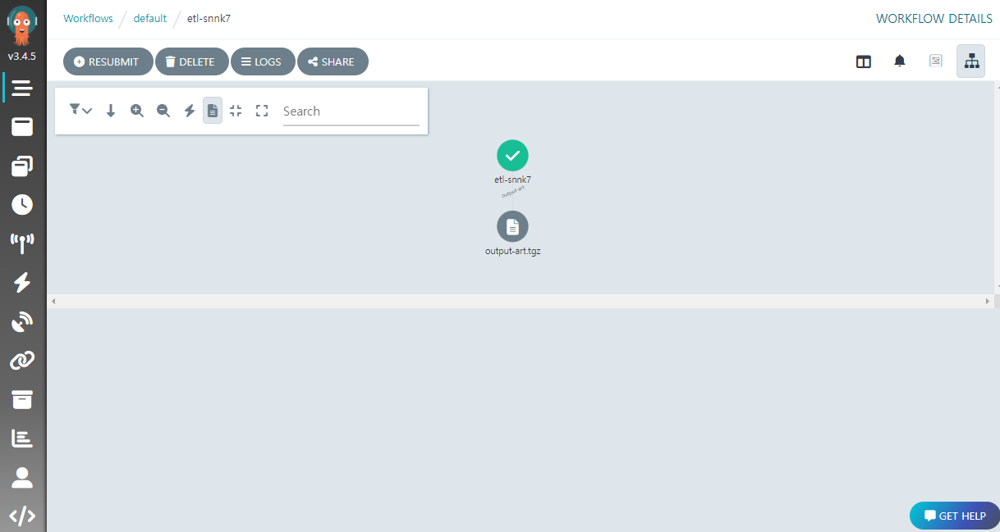

이 글은 쿠버네티스 환경에서 원본 데이터가 저장된 파일을 가져와 정리하는 효율적인 방법에 대해 소개한다.

컨테이너화와 쿠버네티스는 최근 IT 업계에서 매우 중요한 기술 중 하나이다. 컨테이너화는 애플리케이션을 빠르고 쉽게 배포할 수 있도록 해주며, 쿠버네티스는 컨테이너 오케스트레이션 툴로, 컨테이너를 쉽게 관리하고 스케일링하는 등의 기능을 제공한다.

ETL(Extract, Transform, Load)은 데이터 분석 및 처리를 위한 중요한 과정이다. 이 과정에서는 데이터를 추출하고, 변환하여 필요한 형식으로 가공한 다음, 로드하여 저장소에 저장하게 된다. 이러한 ETL 과정은 데이터 처리의 핵심이다.

Argo Events와 Workflows를 이용하면, 쿠버네티스 환경에서 ETL 과정을 자동화하고, 쉽게 관리할 수 있다. Argo Events를 사용하면, 다양한 이벤트 소스로부터 이벤트를 감지하고, Workflow를 시작할 수 있다. Workflow는 ETL 과정의 각 단계를 효율적으로 처리할 수 있도록 도와준다. 이러한 방식으로 Argo Events와 Workflows를 이용하면, 데이터 처리 과정을 자동화하고, 더욱 빠르고 정확하게 처리할 수 있다.

예를 들어, S3 버킷에 새로운 파일이 업로드되면, Argo Events는 이를 감지하고, 새로운 Workflow를 시작한다. Workflow는 파일을 추출하고, 필요한 변환을 수행한 다음, 데이터를 로드하여 저장소에 저장한다. 이러한 방식으로 Argo Events와 Workflows를 이용하면, ETL 과정을 더욱 효율적으로 처리할 수 있으며, 데이터 분석 및 처리 과정을 자동화할 수 있다.

이 글에서는 예제를 통해 위의 과정을 살펴보겠다. 먼저 필요한 개념 및 준비 과정부터 시작하겠다. 


## 준비 

> 이 글은 Linux 환경을 전제로 설명한다. 

### 쿠버네티스 환경

일단 쿠버네티스 환경이 필요한다. 쿠버네티스는 다양한 배포판이 있으나, 예제에서는 로컬에 minikube 가 설치된 것을 가정하고 진행하겠다. 설치 방법은 [이곳](https://minikube.sigs.k8s.io/docs/start/) 을 참고하기 바란다.

또한, 쿠버네티스 환경에 다양한 패키지를 설치하기 위해 패키지 매니저인 [Helm](https://helm.sh/) 의 설치가 필요하다.

### Argo Events 설치

> Argo Events 의 최신 버전은 다음 링크에서 확인할 수 있다.
> https://github.com/argoproj/argo-events/releases

여기서는 버전 1.7.6 을 기준으로 설명한다. Helm 을 통해 Argo 의 차트로 설치한다.

```
helm repo add argo https://argoproj.github.io/argo-helm
helm install aev argo/argo-events
```

추가로 이어서 설명할 EventBus 의 설치가 필요하다.

```yaml
kubectl apply -f - <<EOF
apiVersion: argoproj.io/v1alpha1
kind: EventBus
metadata:
  name: default
spec:
  nats:
    native:
      # 최소 3개 이상
      replicas: 3
      # 인증 전략
      auth: none
EOF
```

### Argo Workflows 설치

> Argo Workflows 의 최신 버전은 다음 링크에서 확인할 수 있다.
> https://github.com/argoproj/argo-workflows/releases

여기서는 버전 3.4.5 를 기준으로 설명한다. Argo Workflows 는 CLI 명령과 컨트롤러 및 서버 설치로 나뉘는데, 먼저 다음과 같이 CLI 를 설치한다.

```bash
# Download the binary
curl -sLO https://github.com/argoproj/argo-workflows/releases/download/v3.4.5/argo-linux-amd64.gz

# Unzip
gunzip argo-linux-amd64.gz

# Make binary executable
chmod +x argo-linux-amd64

# Move binary to path
mv ./argo-linux-amd64 /usr/local/bin/argo

# Test installation
argo version
```

컨트롤러 및 서버는 Helm 을 통해 Bitnami 의 차트로 설치한다.

```bash
helm repo add bitnami https://charts.bitnami.com/bitnami
helm install awf bitnami/argo-workflows --set auth.enabled=false --set postgresql.enabled=false
```

Argo Workflows UI 로그인을 위해 토큰이 필요하다. 최신 K8S 에서는 Service Account 에 기본 토큰이 없기에, 다음처럼 `kubernetes.io/service-account.name` 어노테이션이 있는 Secret 을 만들고 ,

```
kubectl apply -f - <<EOF
apiVersion: v1
kind: Secret
metadata:
  name: awf-argo-workflows-server-secret
  annotations:
    kubernetes.io/service-account.name: awf-argo-workflows-server
type: kubernetes.io/service-account-token
EOF
```

잠시 후에 다음처럼 토큰을 얻을 수 있다. 

```
ARGO_TOKEN="Bearer $(kubectl get secret awf-argo-workflows-server-secret -o=jsonpath='{.data.token}' | base64 --decode)"
echo $ARGO_TOKEN
```

UI 페이지 접속을 위해서 다음과 같이 포트포워딩이 필요하다.

```
kubectl port-forward --namespace default svc/awf-argo-workflows-server 8046:80
```

웹브라우저에서 `http://localhost:8046` 주소로 접속하고, 얻어둔 토큰을 이용해 로그인하면 된다.


### 아티팩트 저장소 준비 

Argo Workflows 에서 아티팩트 (Artifact) 는 템플릿 호출의 결과로 생성되는 리소스나 파일을 말한다. 호출간 결과물을 아티팩트의 형태로 공유할 수 있다. 

아티팩트를 사용하기 위해서는 먼저 [아티팩트 저장소 (Artifact Repository)](https://argoproj.github.io/argo-workflows/configure-artifact-repository/) 를 설정하여야 한다. S3, Azure Blob, HDFS 등 다양한 아티팩트 저장소 타입이 있는데, 여기서는 [MinIO](https://min.io/) 를 이용하겠다. 

앞에서와 마찬가지로 [Helm](https://helm.sh/) 을 통해 Bitnami 의 차트로 설치한다.

```
helm install minio bitnami/minio --set auth.rootPassword=admindjemals
```

설치 후 MinIO 루트유저의 이름과 암호는 다음과 같이 얻을 수 있다.
```
# MinIO 루트유저 이름
kubectl get secret --namespace default minio -o jsonpath="{.data.root-user}" | base64 -d
# MinIO 루트유저 암호 
kubectl get secret --namespace default minio -o jsonpath="{.data.root-password}" | base64 -d
```

이제 minikube 기준으로 다음처럼 MinIO UI 의 접속 URL 을 얻는다.
```
$ minikube service --url minio
😿  service default/minio has no node port
http://127.0.0.1:44337
http://127.0.0.1:43593
```

아래에 출력된 URL 로 접속한 후 앞에서 얻어둔 루트 유저 이름과 암호로 로그인한다. 


이후 `Create Bucket` 링크를 눌러 `artifact` 이라는 이름의 버킷을 만든다.


실제 워크플로우가 사용할 저장소는 [아티팩트 저장소 레퍼런스](https://argoproj.github.io/argo-workflows/artifact-repository-ref/) 로 설정하는데, 그것은 쿠버네티스의 `ConfigMap` 을 통해 만들어진다. 다음과 같이 실행하면 된다.

```yaml
kubectl apply -f - <<EOF
apiVersion: v1
kind: ConfigMap
metadata:
  name: artifact-repositories
  annotations:
    workflows.argoproj.io/default-artifact-repository: default-minio-repository
data:
  default-minio-repository: |
    s3:
      bucket: artifact
      endpoint: minio:9000
      insecure: true
      accessKeySecret:
        name: minio
        key: root-user
      secretKeySecret:
        name: minio
        key: root-password
EOF
```

모든 설치가 완료되었으면, 지금부터 Argo Events 및 Argo Workflows 의 기본 개념을 살펴보겠다. 

## Argo Events 소개 

전통적으로 많은 조직에서 특정 시간이되면 원본 데이터가 갱신된 것을 가정하고, 가져와 처리하는 방식을 많이 사용하였다. 이는 일견 단순해 보이나 문제점을 내포하고 있다. 특히 다음과 같은 경우에 문제가 크다:

- 지정 시간에 원본 파일이 존재하지 않거나 불완전한 경우
- 지정 시간에 ETL 된 파일의 내용이 갱신되어 다시 올라오는 경우
- 지정 시간의 ETL 작업 종료 후 추가 파일이 올라오는 경우

이런 문제가 빈번한 경우 대응을 위해 모니터링 및 수동 재작업을 실시하곤 하는데, 시간 및 인적 리소스가 소모가 크다.

문제를 근원적으로 해결하기 위해서는 원본 데이터가 올라오는 이벤트를 인식하고, 해당 이벤트 발생시 작업을 진행하는 이벤트 기반 (Event-Driven) 방식의 도입이 필요한다. 이렇게 하면 파일이 예상보다 늦게 올라오거나, 바뀐 내용으로 다시 올라오는 경우에도 자동으로 재작업이 진행되기 때문이다.

Argo Events 는 이러한 이벤트 기반 처리를 위한 훌륭한 툴로, 다음과 같은 구성 요소를 가진다.

### Event 와 EventSource

Argo Events에서 Event는 구체적인 이벤트를 의미하며, EventSource는 하나 이상의 Event 타입을 통해 고수준의 이벤트를 정의하는 역할을 한다. 

> 단일 이벤트만 가지는 이벤트소스가 많기에, 이벤트 타입이 이벤트소스의 타입으로 불려지곤 한다.

아래와 같은 이벤트 타입이 있다:

- 달력
- 파일
- HTTP (웹훅)
- AWS S3, SNS, SQS
- 쿠버네티스 리소스
- Kafka
- GitHub / GitLab

> 이 외에도 다양한 타입이 있으며, 필요하다면 커스텀 이벤트소스를 만들 수 있다.
> https://argoproj.github.io/argo-events/eventsources/generic/

### Sensor 와 Trigger

Argo Events에서 Sensor는 자신이 의존하는 EventSource 에서 이벤트가 발생하면 자신에게 등록된 하나 이상의 Trigger를 활성화하는 역할을 한다. Trigger는 발생한 이벤트 매개변수와 환경 정보를 참고해 지정된 동작을 실행한다. 

> 단일 트리거만 가지는 센서가 많기에, 트리거 타입이 센서의 타입으로 불려지곤 한다.

아래와 같은 트리거 타입이 있다:

- HTTP 
- Argo Workflows
- AWS Lambda
- 쿠버네티스 리소스
- Kafka 메시지
- 로그 (디버깅 용)

> 이 외에도 다양한 타입이 있으며, 필요하다면 커스텀 트리거를 만들 수 있다. 
> https://argoproj.github.io/argo-events/sensors/triggers/build-your-own-trigger/

하나의 Sensor가 하나 이상의 Trigger를 가질 수 있으며, 이를 통해 다양한 Workflow를 실행할 수 있다.

### EventBus

Argo Events 에서 EventBus 는 이벤트 소스를 센서로 전달해주는 커스텀 쿠버네티스 리소스이다. 그렇게 하기 위해 EventBus 는 네임스페이스 안에 만들어져야 한다. 

> 이벤트버스는 오픈소스 경량 메시지 브로커인 [NATS](https://docs.nats.io/) 를 이용해 구현되었다.

---

이제 HTTP 포스트를 통해서 워크플로우를 트리거하는 예제를 살펴보자.

아래는 웹훅 이벤트소스 파일 `webhook.yaml` 이다. 

```yaml
apiVersion: argoproj.io/v1alpha1
kind: EventSource
metadata:
  name: webhook
spec:
  service:
    ports:
      - port: 12000
        targetPort: 12000
  webhook:
    # 이벤트 소스는 하나 이상의 HTTP 서버를 띄울 수 있다.
    example:
      # HTTP 서버 포트
      port: "12000"
      # 리슨할 엔드포인트 
      endpoint: /example
      # 허용되는 HTTP 메소드
      method: POST
```

이를 이용해 다음처럼 웹훅 이벤트소스를 생성한다. 

```
kubectl apply -f webhook.yaml
```

아래는 로그 센서 파일 `log.yaml` 이다.

```yaml
apiVersion: argoproj.io/v1alpha1
kind: Sensor
metadata:
  name: log
spec:
  dependencies:
  # 이 센서가 의존하는 이벤트 소스 
  - name: test-dep
    eventSourceName: webhook
    eventName: example
  triggers:
  - template:
      name: log-trigger
      log:
        intervalSeconds: 1        
```

이를 이용해 다음처럼 로그 센서를 생성한다. 

```
kubectl apply -f log.yaml
```

이제 다음과 같이 지금까지 생성된 리소스를 확인할 수 있다. 

```
$ kubectl get pods
NAME                                                 READY   STATUS    RESTARTS   AGE
aev-argo-events-controller-manager-b99485cdf-ql8z2   1/1     Running   0          5m38s
awf-argo-workflows-controller-75686d754d-msrbg       1/1     Running   0          2m19s
awf-argo-workflows-server-588d6686bb-6qc5z           1/1     Running   0          2m19s
eventbus-default-stan-0                              2/2     Running   0          4m5s
eventbus-default-stan-1                              2/2     Running   0          3m53s
eventbus-default-stan-2                              2/2     Running   0          3m51s
log-sensor-rp56d-f8b5b694-bs99c                      1/1     Running   0          9s
webhook-eventsource-cfkdt-7fc944c598-mxlb9           1/1     Running   0          71s
```

> 파드 이름에 임의의 문자열이 붙어있는데, 이 부분은 실제 실습에서 나오는 것으로 대체하자. 

웹훅 이벤트소스 `webhook-eventsource-cfkdt-7fc944c598-mxlb9` 파드와 로그 센서 `log-sensor-rp56d-f8b5b694-bs99c` 파드를 확인할 수 있다. 이벤트버스는 고가용성을 위해 3개 이상의 파드를 이용한다.

호스트에서 POST 메소드를 호출하기 위해 포트포워딩을 한다. 

```
kubectl port-forward $(kubectl get pod -l eventsource-name=webhook -o name) 12000:12000
```

이제 웹훅 이벤트를 발생시키면, 이벤트 -> 이벤트 소스 -> 이벤트버스 -> 센서 -> 트리거의 순으로 진행될 것이다. 확인을 위해 다음처럼 로그 센서 파드의 로그를 모니터링 한다.

```
kubectl logs -f log-sensor-rp56d-f8b5b694-bs99c
```

이제 다음처럼 엔드포인트로 POST 를 호출하면,
```
curl -d '{"message":"this is my first webhook"}' -H "Content-Type: application/json" -X POST http://localhost:12000/example
```

트리거가 실행된 것을 로그로 확인할 수 있다.

```
{"level":"info","ts":1678248798.7899067,"logger":"argo-events.sensor","caller":"log/log.go:46","msg":"{\"header\":{\"Accept\":[\"*/*\"],\"Content-Length\":[\"38\"],\"Content-Type\":[\"application/json\"],\"User-Agent\":[\"curl/7.68.0\"]},\"body\":{\"message\":\"this is my first webhook\"}}","sensorName":"log","triggerName":"log-trigger","triggerType":"Log",
...
```

## Argo Workflows 소개

Argo Workflows는 데이터 처리와 같은 일괄 처리 작업을 처리하기 위해 사용되는데, Argo Events가 감지한 이벤트를 실질적으로 처리하기 위한 워크플로우를 구성하게 된다.

워크플로우는 쿠버네티스의 Job 리소스와 비슷한 구성의 yaml 파일로 작성한다. 

### 단순한 워크플로우 예제

다음은 간단한 워크플로우의 예이다.

```yaml
apiVersion: argoproj.io/v1alpha1
kind: Workflow
metadata:
  generateName: hello-world-  # 워크플로우 이름 생성용 접두어 
spec:
  # 사용할 템플릿을 정의 
  templates:
  - name: whalesay            # `whalesay` 템플릿 정의 
    container:
      image: docker/whalesay
      command: [cowsay]
      args: ["hello world"]   
  # 위 템플릿으로 시작
  entrypoint: whalesay        
```

> 여기서 사용되는 `whalesay` 컨테이너 이미지는, 인자 (`args`) 로 건네진 메시지를 고래와 함께 출력해주는 간단한 기능을 한다.

위 파일을 `hello-world.yaml` 로 저장하고 다음처럼 CLI 를 통해 적용한다. 

```
argo submit --watch hello-world.yaml
```

`--watch` 는 워크플로우가 완료될 때까지 정보를 계속 표시한다. 

> 아래와 같이 `kubectl` 을 이용해도 된다.
> ```
> kubectl create -f hello-world.yaml
> ```

다른 에러가 없다면, 성공적으로 워크플로우가 만들어진 것이다. CLI 를 통해 확인할 수 있다. 

```
$ argo list

NAME                STATUS      AGE   DURATION   PRIORITY   MESSAGE
hello-world-lncsd   Succeeded   2m    30s        0
```

워크플로우 이름은 앞서 `generateName` 으로 기술한 `hello-world-` 뒤에 랜덤 문자열이 붙은 형태이다. 

Argo Workflows UI 페이지에서도 생성된 워크플로우 정보와 로그를 확인할 수 있다.


> 만약 UI 에서 워크플로우가 보이지 않는다면, NAMESPACE 가 `default` 인지, LABELS 가 비어있는지 확인해보자.


지금까지 예제에서는 `templates` 아래 단일 템플릿을 정의하고 그것을 바로 실행했는데, 더 다양한 방식으로 템플릿을 이용할 수 있다. 템플릿에는 모두 6가지 타입이 있는데, 크게 정의용 템플릿과 호출용 템플릿으로 분류한다.

### 정의 템플릿

정의 (Definition) 템플릿은 구체적인 단위 작업을 기술하는데 사용된다. 주로 이후에 설명할 호출 템플릿을 통해 불려지는 용도이나, `entrypoint` 로 지정하면 바로 실행될 수 있다.

#### Container 템플릿 

컨테이너 템플릿은 가장 자주 사용되는 타입으로, 쿠버네티스의 컨테이너 스펙과 같은 구조를 가진다. 특정 컨테이너 이미지와 명령, 그리고 인자를 지정하여 실행할 수 있다. 

아래 템플릿은 `docker/whalesay` 이미지에서 `hello world` 를 인자로 `cowsay` 명령을 실행하는 예이다.

```yaml
- name: whalesay
  container:
    image: docker/whalesay
    command: [cowsay]
    args: ["hello world"]
```

#### Script 템플릿 

스크립트 템플릿은 컨테이너 템플릿을 편의상 포장한 것으로, 다른 스펙은 비슷하나 `source` 필드에 직접 코드를 기입할 수 있다는 점이 다르다. 

다음은 파이썬 컨테이너 이미지에서 파이썬 코드로 랜덤값을 출력하는 예이다.

```yaml
- name: gen-random-int
  script:
    image: python:alpine3.6
    command: [python]
    source: |
      import random
      i = random.randint(1, 100)
      print(i)
```

스크립트 템플릿의 결과는 `stdout` 으로 출력되고, 그것은 `outputs.result` 로 얻을 수 있다. 다른 템플릿에서 `{{tasks.<NAME>.outputs.result}}` 또는 `{{steps.<NAME>.outputs.result}}` 형식으로 참조할 수 있다.

#### Resource 템플릿 

리소스 템플릿은 쿠버네티스 클러스터의 리소스로 직접 작업을 하는 타입이다. `get`, `create`, `apply`, `delete`, `replace`, `patch` 동작이 가능하다.

다음 예는 쿠버네티스의 `ConfigMap` 리소스를 생성한다.

```yaml
- name: k8s-owner-reference
  resource:
    action: create
    manifest: |
      apiVersion: v1
      kind: ConfigMap
      metadata:
        generateName: owned-eg-
      data:
        some: value
```

#### Suspend 템플릿

서스펜드 템플릿은 주어진 시간동안, 또는 수동 명령이 있을 때까지 실행을 멈추고 기다리는데 사용된다. CLI 의 `argo resume` 명령으로 재개할 수 있다.

```yaml
- name: delay
  suspend:
    duration: "20s"
```

### 호출 템플릿

호출 (Invocation) 템플릿은 다른 템플릿을 호출하여 실제 작업을 진행한다. 각 호출은 다음과 같은 구성을 가진다.

```yaml
name:     # 자신의 이름
template: # 호출할 템플릿 
arguments: # 호출 인자값
  parameters:  # 매개 변수별 값
```

> Argo Events 및 Workflows 에서 argument 와 parameter 의 구분:
> `argument` - 인자로 사용되는 구체적인 값. 따라서 `template` 에서 사용되지 않음. 
> `parameter` - 매개 변수, 즉 정해지지 않은 변수. 따라서 `template` 에서 사용됨.

#### Steps 템플릿

하나 이상의 템플릿 호출 스텝으로 구성된다. 각 스텝은 호출의 리스트로 구성된다. 각 스텝은 정의된 순서대로 실행되고, 스텝내의 호출은 병렬로 실행된다.

아래 예에서 `steps` 필드 아래에 각 스텝이 기술되어 있다. `step1` 이 실행된 후, `step2a` 와 `step2b` 가 동시에 실행된다.

> 스텝 리스트인 `steps` 아래 호출 리스트가 기술되는 구조이기에 `- -` 로 표기된 것에 주의하자.

```yaml
- name: hello-hello-hello
  steps:
  - - name: step1
      template: prepare-data
  - - name: step2a
      template: run-data-first-half
    - name: step2b
      template: run-data-second-half
```

#### DAG 템플릿 

DAG (Directed Acyclic Graph) 는 *유향 비순환 그래프* 를 나타내는데, 복수의 태스크 (task) 들이 의존 관계 그래프로 구성될 때 유용하다. 

아래 예제처럼, 이러한 DAG 구조 템플릿 정의를 위해 `dag/tasks` 필드를, 태스크간 의존 관계를 기술하기 위해 `depends` 필드를 이용한다.

```yaml
- name: diamond
  dag:
    tasks:
    - name: A
      template: echo
    - name: B
      depends: "A"
      template: echo
    - name: C
      depends: "A"
      template: echo
    - name: D
      depends: "B && C"
      template: echo
```

> 과거에는 태스크간 의존 관계 기술에 `dependencies` 필드가 사용되었는데, 기능이 제한적이어서 `depends` 필드가 도입되었다. 이것은 의존 태스크의 상태 및 불 논리 연산자도 지원한다. 자세한 것은 [문서](https://argoproj.github.io/argo-workflows/enhanced-depends-logic/#depends) 를 참고하자.

예제는 다음과 같은 다이아몬드 구조를 가진다.

```  
    A
   / \
  B   C
   \ /
    D
```

그림에서 최종 스텝 D를 수행하기 위해, B 와 C 가 필요하고, B 와 C 가 수행되기 위해서는 A 가 먼저 수행되어야 한다.

### 매개변수와 인자

Argo Workflows 에서 매개변수 (Parameter) 와 인자 (Argument) 는 재활용성을 높이는 중요한 역할을 한다. 매개변수는 임의의 값을 받을 수 있는 변수이고, 인자는 매개변수에 넘겨주는 구체적인 값을 말한다. 

#### 글로벌 매개변수 

매개변수는 워크플로우 및 템플릿에 대해 정의할 수 있는데, 워크플로우에 정의된 매개변수를 *글로벌 매개변수 (Global Paramter)* 라고 부른다. `argo submit` 명령을 내릴 때 `-p` 옵션을 이용해 글로벌 매개변수에 다른 값을 주어 워크플로우가 다양한 동작을 하게 할 수있다.

아래 예제에서는 `spec/arguments` 블록 아래에 글로벌 매개변수의 인자를 지정하고, 템플릿 명령 (`command`) 의 인자가 그것을 직접 참조하고 있다. 내용을 `global-parameters.yaml` 로 저장하자.

```yaml
apiVersion: argoproj.io/v1alpha1                                                                                                   kind: Workflow
metadata:
  generateName: global-parameters-
spec:
  entrypoint: whalesay1
  # 글로벌 매개변수의 인자. Argo CLI 로 오버라이딩 가능
  arguments:
    parameters:
    - name: message
      value: hello world

  templates:
  - name: whalesay1
    container:
      image: docker/whalesay:latest
      command: [cowsay]
      # 글로벌 매개변수를 직접 참조 
      args: ["{{workflow.parameters.message}}"]
```

> 

다음과 같이 적용하면 
```
argo submit --watch global-parameters.yaml
```

워크플로우에서 지정된 인자 `hello world` 가 로그에 출력되지만 다음과 같이 적용하면,

```
argo submit --watch global-parameters.yaml -p message="goodbye world"
```

`argo submit` 의 옵션으로 지정된 인자 `goodbye world 로 덮어 써져 출력되는 것을 확인할 수 있다.

#### 템플릿 입력/출력 매개변수

앞선 예제는 템플릿 명령의 인자가 직접 글로벌 매개변수를 참조하였지만, 템플릿에 입력 매개변수를 정의하고, 템플릿 명령의 인자가 그것을 참조하도록 할 수도 있다.

> 입출력 매개변수는 템플릿 정의 시 사용된다.

다음 내용을 `arguments-parameters.yaml` 로 저장하자.

```yaml
apiVersion: argoproj.io/v1alpha1                                                                                                   kind: Workflow
metadata:
  generateName: arguments-parameters-
spec:
  entrypoint: whalesay
  # 글로벌 매개변수의 인자. Argo CLI 로 오버라이딩 가능
  arguments:
    parameters:
    - name: message
      value: hello world

  templates:
  - name: whalesay
    # 템플릿 입력 매개변수
    inputs:
      parameters:
      - name: message
    container:
      image: docker/whalesay:latest
      command: [cowsay]
      # 템플릿 입력 매개변수를 참조
      args: ["{{inputs.parameters.message}}"]
```

다음과 같이 적용하면 
```
argo submit --watch arguments-parameters.yaml -p message="goodbye world"
```

구조는 바뀌었지만, 결과는 아까와 동일하다.

출력 매개변수는 호출 결과 파일의 내용을 매개변수의 값으로 이용할 수 있게 해준다. 자세한 예제는 좀 있다 살펴보겠다.

> 입력과 출력에는 매개변수 외에도 다양한 필드를 지정하여 사용할 수 있다.
> `inputs` - `artifacts`, `parameters`
> `outputs` - `artifacts`, `exitCode`, `parameters`, `result`

이제 호출 템플릿을 이용하여 동작하는 예제를 살펴보겠다.

### 멀티 스텝 워크플로우 예제

다음은 정의된 템플릿을 한 번 이상 순차적으로, 혹은 동시에 호출하여 작업을 구성하는 예제이다. 이를 위해 `steps` 필드 아래에 호출을 기술하고 있다. 아래 내용을 `steps.yaml` 파일로 저장하자.

```yaml
apiVersion: argoproj.io/v1alpha1
kind: Workflow
metadata:
  generateName: steps-
spec:
  templates:
  # 공통 템플릿 정의
  - name: whalesay
    # message 변수를 템플릿 입력으로
    inputs:
      parameters:
      - name: message
    container:
      image: docker/whalesay
      command: [cowsay]
      # 템플릿 매개 변수를 명령 인자로 사용
      args: ["{{inputs.parameters.message}}"]

  # 공통 템플릿을 호출하는 멀티스텝 템플릿
  - name: hello-hello-hello
    steps:
    # 1. hello1
    - - name: hello1
        template: whalesay
        # 매개 변수별 인자값
        arguments:
          parameters: [{name: message, value: "hello1"}]
    # 2. hello2a, hello2b
    - - name: hello2a
        template: whalesay
        # 매개 변수별 인자값
        arguments:
          parameters: [{name: message, value: "hello2a"}]
      - name: hello2b
        template: whalesay
        # 매개 변수별 인자값
        arguments:
          parameters: [{name: message, value: "hello2b"}]
  
  # 멀티 스텝 템플릿으로 시작
  entrypoint: hello-hello-hello
```

다음처럼 실행하면,

```
argo submit --watch steps.yaml
```

아래와 같은 출력이 나올 것이다.

```
Name:                steps-wk5m5
Namespace:           argo
ServiceAccount:      unset (will run with the default ServiceAccount)
Status:              Succeeded
Conditions:
 PodRunning          False
 Completed           True
Created:             Mon Mar 06 18:43:10 +0900 (30 seconds ago)
Started:             Mon Mar 06 18:43:10 +0900 (30 seconds ago)
Finished:            Mon Mar 06 18:43:40 +0900 (now)
Duration:            30 seconds
Progress:            3/3
ResourcesDuration:   18s*(1 cpu),18s*(100Mi memory)

STEP            TEMPLATE           PODNAME                          DURATION  MESSAGE
 ✔ steps-wk5m5  hello-hello-hello
 ├───✔ hello1   whalesay           steps-wk5m5-whalesay-1602185977  6s
 └─┬─✔ hello2a  whalesay           steps-wk5m5-whalesay-3712874914  9s
   └─✔ hello2b  whalesay           steps-wk5m5-whalesay-3696097295  6s
```

`hello1` 이 먼저 실행된 후, `hello2a` 와 `hello2b` 가 동시에 실행되는 것을 보여주는데, UI 에서 좀 더 확실히 확인할 수 있다. 


kubectl 로 보면 각 템플릿 호출마다 파드가 생성된 것을 확인할 수 있다.

```
$ kubectl get pods 
NAME                                   READY   STATUS      RESTARTS   AGE
argo-server-fb8f5967d-tlqs5            1/1     Running     0          3h54m
steps-wk5m5-whalesay-1602185977        0/2     Completed   0          6m1s
steps-wk5m5-whalesay-3696097295        0/2     Completed   0          5m51s
steps-wk5m5-whalesay-3712874914        0/2     Completed   0          5m51s
workflow-controller-78f7ffdf79-7rctb   1/1     Running     0          3h55m
```

> 어떤 파드가 어떤 호출에 속하는지는 파드 정보의 `Annotations` 블럭을 보면 알 수 있다. 예를 들면 아래와 같은 식이다.
> ```bash
> $ kubectl describe pod steps-wk5m5-whalesay-1602185977
> ...
> Annotations:
>   workflows.argoproj.io/node-name: steps-wk5m5[0].hello1
> ...
> ```

파드의 로그를 확인해보면 아래와 같이 기술된 매개변수로 공용 템플릿이 호출된 것을 알 수있다.

`hello1` 호출 로그
```
 _________
< hello1 >
 ---------
    \
     \
      \
                    ##        .
              ## ## ##       ==
           ## ## ## ##      ===
       /""""""""""""""""___/ ===
  ~~~ {~~ ~~~~ ~~~ ~~~~ ~~ ~ /  ===- ~~~
       \______ o          __/
        \    \        __/
          \____\______/
```
`hello2a` 호출 로그
```
 _________
< hello2a >
 ---------
    \
     \
      \
                    ##        .
              ## ## ##       ==
           ## ## ## ##      ===
       /""""""""""""""""___/ ===
  ~~~ {~~ ~~~~ ~~~ ~~~~ ~~ ~ /  ===- ~~~
       \______ o          __/
        \    \        __/
          \____\______/
```
`hello2b` 호출 로그
```
 _________
< hello2b >
 ---------
    \
     \
      \
                    ##        .
              ## ## ##       ==
           ## ## ## ##      ===
       /""""""""""""""""___/ ===
  ~~~ {~~ ~~~~ ~~~ ~~~~ ~~ ~ /  ===- ~~~
       \______ o          __/
        \    \        __/
          \____\______/
```

#### 출력 매개변수를 사용하는 멀티 스텝 예제 

앞에서 소개한 출력 매개변수를 이용하는 멀티 스텝 예제를 살펴보겠다.

> 입력 매개변수는 컨테이너 및 스크립트 템플릿에서 모두 사용되나, 출력 매개변수는 컨테이너 템플릿에서만 필요하다 (스크립트 템플릿은 표준출력 결과가 자동으로 `outputs.result` 에 들어감). 
> 컨테이너 템플릿은 하나 이상의 출력 매개변수를 가질 수 있다.

다음 예제에서 `whalesay` 컨테이너 템플릿은, 실행 결과 파일 `/tmp/hello_world.txt` 의 내용을 출력 매개변수 `hello-param` 의 값으로 설정한다. 이 출력값은 다음 스텝 `print-message` 의 입력 매개변수에 넘겨진다.

아래 내용을 `output-parameter.yaml` 로 저장하자. 

```yaml
apiVersion: argoproj.io/v1alpha1
kind: Workflow
metadata:
  generateName: output-parameter-
spec:
  entrypoint: output-parameter
  templates:
  # 템플릿 호출
  - name: output-parameter
    steps:
    # 매개변수 생성 
    - - name: generate-parameter
        template: whalesay
    # 매개변수 출력 
    - - name: consume-parameter
        template: print-message
        # 선행 스텝의 출력 매개변수에서 인자값을 얻음 
        arguments:
          parameters:
          - name: message
            value: "{{steps.generate-parameter.outputs.parameters.hello-param}}"

  # 템플릿 정의
  - name: whalesay
    container:
      image: docker/whalesay:latest
      command: [sh, -c]
      args: ["sleep 1; echo -n hello world > /tmp/hello_world.txt"]
    outputs:
      parameters:
      - name: hello-param
        valueFrom:
          default: "Foobar"           # 지정된 경로의 파일이 없으면 이 값을 이용
          path: /tmp/hello_world.txt  # 출력 매개변수의 값을 얻을 파일 경로
  - name: print-message
    # 입력 매개변수 
    inputs:
      parameters:
      - name: message
    container:
      image: docker/whalesay:latest
      command: [cowsay]
      # 입력 매개변수의 값을 명령 인자로 이용 
      args: ["{{inputs.parameters.message}}"]
```

다음처럼 실행하면,

```
argo submit --watch output-parameter.yaml
```

로그에 `hello world` 가 출력되는 것을 확인할 수 있다.

### DAG 워크플로우 예제

아래는 앞서 본 다이아몬드 구조 워크플로우의 예이다. 멀티 스텝보다 복잡한 트리 구조를 표현할 수 있다. DAG 구조 템플릿 정의를 위해 `dag` 필드를, 호출의 의존 관계를 기술하기 위해 `depends` 필드를 이용한다. 내용을 `dag-diamond.yaml` 파일로 저장한다.

```yaml
apiVersion: argoproj.io/v1alpha1
kind: Workflow
metadata:
  generateName: dag-diamond-
spec:
  entrypoint: diamond
  templates:
  # 공통 템플릿 정의
  - name: echo
    inputs:
      parameters:
      - name: message
    container:
      image: alpine:3.7
      command: [echo, "{{inputs.parameters.message}}"]
  # 공통 템플릿을 호출하는 멀티 스텝 템플릿 정의
  - name: diamond
    dag:
      tasks:
      - name: A
        template: echo
        arguments:
          parameters: [{name: message, value: A}]
      - name: B
        depends: "A"       # A 에 의존
        template: echo
        arguments:
          parameters: [{name: message, value: B}]
      - name: C
        depends: "A"       # A 에 의존
        template: echo
        arguments:
          parameters: [{name: message, value: C}]
      - name: D
        depends: "B && C"  # B 와 C 에 의존
        template: echo
        arguments:
          parameters: [{name: message, value: D}]
```

> 하나 이상의 선행 호출을 의존하는 D 의 경우 `B && C` 형태로 기술하였다.
> 의존 관계를 위해 다양한 논리 연산을 지원하는 데, 자세한 것은 [공식 페이지](https://argoproj.github.io/argo-workflows/enhanced-depends-logic/) 를 참고하자. 

다음처럼 실행하면,

```
argo submit --watch dag-diamond.yaml
```

아래와 같은 출력이 나올 것이다.

```
Name:                dag-diamond-d6xfs
Namespace:           argo
ServiceAccount:      unset (will run with the default ServiceAccount)
Status:              Succeeded
Conditions:
 PodRunning          False
 Completed           True
Created:             Tue Mar 07 12:00:27 +0900 (40 seconds ago)
Started:             Tue Mar 07 12:00:27 +0900 (40 seconds ago)
Finished:            Tue Mar 07 12:01:07 +0900 (now)
Duration:            40 seconds
Progress:            4/4
ResourcesDuration:   16s*(1 cpu),16s*(100Mi memory)

STEP                  TEMPLATE  PODNAME                            DURATION  MESSAGE
 ✔ dag-diamond-d6xfs  diamond
 ├─✔ A                echo      dag-diamond-d6xfs-echo-1891072275  8s
 ├─✔ B                echo      dag-diamond-d6xfs-echo-1907849894  4s
 ├─✔ C                echo      dag-diamond-d6xfs-echo-1924627513  4s
 └─✔ D                echo      dag-diamond-d6xfs-echo-1941405132  4s
```

이 출력 만으로는 DAG의 구조를 파악하기가 쉽지 않다. UI 에서 살펴보면 확실히 파악할 수 있다.


다음으로는 템플릿 호출간 결과물을 주고 받는 방법을 알아보겠다.

### 루프 예제 

워크플로우 내에서 다양한 인자로 하부 과제가 여러번 호출되어야 하는 경우 여기서 소개하는 루프 (Loop) 기능을 이용하면 편리하다.

다음 내용을 `loops.yaml` 이라는 이름으로 저장하자.

```yaml
apiVersion: argoproj.io/v1alpha1
kind: Workflow
metadata:
  generateName: loops-
spec:
  entrypoint: loop-example
  templates:
  # 호출 템플릿 
  - name: loop-example
    steps:
    - - name: print-message
        template: whalesay
        arguments:
          parameters:
          - name: message
            value: "{{item}}"
        withItems:              # whalesay 템플릿을 아래의 두 인자값으로 동시에 각각 호출한다.
        - hello world           # item 1
        - goodbye world         # item 2

  # 정의 템플릿 
  - name: whalesay
    inputs:
      parameters:
      - name: message
    container:
      image: docker/whalesay:latest
      command: [cowsay]
      args: ["{{inputs.parameters.message}}"]

```

다음처럼 실행하면,

```
argo submit --watch loops.yaml
```

`whalesay` 템플릿이 `withItems` 필드에서 지정된 `hello world` 와 `goodbye world` 의 두 인자값으로 각각 동시에 호출되는 것을 확인할 수 있다.


#### 객체 형태의 인자로 루프 이용 

`withItems` 아래에는 단순한 값이 아닌, 객체 형태의 항목도 올 수있다. 다음 예는 `{ image: 'debian', tag: '9.1' }` 형태의 객체로 항목을 기술하고 그것을 인자로 템플릿을 동시에 호출하고 있다. 내용을 `loops-maps.yaml` 파일로 저장하자.


```yaml
apiVersion: argoproj.io/v1alpha1
kind: Workflow
metadata:
  generateName: loops-maps-
spec:
  entrypoint: loop-map-example
  # 호출 템플릿
  templates:
  - name: loop-map-example
    steps:
    - - name: test-linux
        template: cat-os-release
        arguments:
          parameters:
          - name: image
            value: "{{item.image}}"
          - name: tag
            value: "{{item.tag}}"
        withItems:
        # 컨테이너 이미지 이름과 태그 정보
        - { image: 'debian', tag: '9.1' }       # item set 1
        - { image: 'debian', tag: '8.9' }       # item set 2
        - { image: 'alpine', tag: '3.6' }       # item set 3
        - { image: 'ubuntu', tag: '17.10' }     # item set 4

  # 정의 템플릿
  - name: cat-os-release
    # 입력 매개변수
    inputs:
      parameters:
      - name: image
      - name: tag
    container:
      # 호출측에서 인자값으로 건네진 이미지 정보로 컨테이너를 실행
      image: "{{inputs.parameters.image}}:{{inputs.parameters.tag}}"
      command: [cat]
      args: [/etc/os-release]
```

이 예제는 흥미롭게도 `withItems` 로 건네진 이미지 정보를 이용해서 컨테이너를 실행하고 있다. 다음처럼 실행하면,

```
argo submit --watch loops-maps.yaml
```

Argo Workflows UI 에서 다음처럼 4 개 호출이 동시에 진행된 것을 알 수 있다.


#### DAG 에서 루프 이용 

다음 예제는 앞서 소개한 DAG 형태 템플릿을 이용한 워크플로우이다. 태스크 `B` 에서 `withItems` 를 통한 루프 기능을 사용하고 있다. 이러한 경우 그 다음 태스크 `C` 에서 `B` 에 대한 의존성만 선언해주면, 태스크 `B` 의 모든 호출이 완료된 후 `C` 가 실행된다.

다음 내용을 `loops-dag.yaml` 로 저장하자.

```yaml
apiVersion: argoproj.io/v1alpha1
kind: Workflow
metadata:
  generateName: loops-dag-
spec:
  entrypoint: loops-dag
  templates:
  - name: loops-dag
    dag:
      tasks:
      - name: A
        template: whalesay
        arguments:
          parameters:
          - {name: message, value: A}
      - name: B
        depends: "A"
        template: whalesay
        arguments:
          parameters:
          - {name: message, value: "{{item}}"}
        withItems:
        - foo
        - bar
        - baz
      - name: C
        depends: "B"
        template: whalesay
        arguments:
          parameters:
          - {name: message, value: C}

  - name: whalesay
    inputs:
      parameters:
      - name: message
    container:
      image: docker/whalesay:latest
      command: [cowsay]
      args: ["{{inputs.parameters.message}}"]
```

다음처럼 실행하면,

```
argo submit --watch loops-dag.yaml
```

루프를 통해 생성된 태스크 `B` 의 호출 3 개가 모두 완료된 후, `C` 가 실행되는 것을 확인할 수 있다. 


### 아티팩트 워크플로우 예제

이 예제는 멀티 스텝 형태로, 첫 스텝 `generate-artifact` 에서 아티팩트를 생성하고, 다음 스텝 `print-message` 에서 생성된 아티팩트를 이용하도록 구현되어 있다. 내용을 `artifact-passing.yaml` 로 저장하자.

```yaml
apiVersion: argoproj.io/v1alpha1
kind: Workflow
metadata:
  generateName: artifact-passing-
spec:
  entrypoint: artifact-example
  templates:
  # 아티팩트 생성용 정의 템플릿
  - name: whalesay
    container:
      image: docker/whalesay:latest
      command: [sh, -c]
      args: ["sleep 1; cowsay hello world | tee /tmp/hello_world.txt"]
    # 출력으로 사용할 아티팩트
    outputs:
      artifacts:
      # 생성된 /tmp/hello_world.txt 파일에서 hello-art 아티팩트를 생성
      # (아티팩트는 파일뿐만 아니라 디렉토리 형태도 가능)
      - name: hello-art             # 출력 아티팩트 이름 
        path: /tmp/hello_world.txt  # 출력 아티팩트 소스 파일

  # 아티팩트 프린트용 정의 템플릿
  - name: print-message
    # 입력으로 사용할 아티팩트
    inputs:
      artifacts:
      # 전달받은 아티팩트를 풀어서 /tmp/message 파일에 저장
      - name: message       # 입력 아티팩트 이름 
        path: /tmp/message  # 입력 아티팩트 파일
    container:
      image: alpine:latest
      # 아티팩트에서 풀린 파일 프린트
      command: [sh, -c]
      args: ["cat /tmp/message"]

  # 멀티스텝 호출 템플릿
  - name: artifact-example
    steps:
    # 1. 아트팩트 생성 호출
    - - name: generate-artifact
        template: whalesay
    # 2. 아티팩트 프린트 호출
    - - name: consume-artifact
        template: print-message
        arguments:
          artifacts:
          # 생성 호출에서 생성된 hello-art 아티팩트를 프린트 템플릿의 입력 아티팩트로 바인딩 
          - name: message
            from: "{{steps.generate-artifact.outputs.artifacts.hello-art}}"
```

다음처럼 실행하면,

```
argo submit --watch artifact-passing.yaml  
```

다음과 같은 출력이 나올 것이다.

```
Name:                artifact-passing-j4rfp
Namespace:           default
ServiceAccount:      unset (will run with the default ServiceAccount)
Status:              Succeeded
Conditions:
 PodRunning          False
 Completed           True
Created:             Wed Mar 08 14:06:55 +0900 (31 seconds ago)
Started:             Wed Mar 08 14:06:55 +0900 (31 seconds ago)
Finished:            Wed Mar 08 14:07:26 +0900 (now)
Duration:            31 seconds
Progress:            2/2
ResourcesDuration:   12s*(1 cpu),12s*(100Mi memory)

STEP                       TEMPLATE          PODNAME                                          DURATION  MESSAGE
 ✔ artifact-passing-j4rfp  artifact-example
 ├───✔ generate-artifact   whalesay          artifact-passing-j4rfp-whalesay-1776896446       5s
 └───✔ consume-artifact    print-message     artifact-passing-j4rfp-print-message-4173331406  8s
```

UI 에서 살펴보면 생성된 아티팩트 `hello-art.tgz` 를 확인할 수 있다.


> 아티팩트는 기본적으로 `tar+gzip` 파일로 압축되는데, 필요에 따라 압축 설정을 바꿀 수 있다.

지금까지 Argo Event 와 Workflows 의 기본적인 동작을 확인하였다. 이제 두 서비스를 결합하여 기본적인 ETL 을 진행하는 예를 살펴보겠다. 

## ETL 기본 예제

일반적인 ETL 예제에서는 로컬에 있는 원본 파일을 불러와 가공하는 식으로 진행하지만, 쿠버네티스 클러스터에서는 다양한 컨테이너가 활용되기에 특정 로컬에 존재하는 파일을 이용하는 방식은 적합하지 않다. 따라서 MinIO 같은 블럭 스토리지 서비스가 활용되어야 한다.

이 예제는 MinIO 에 ETL 대상 파일이 올라온 경우, 그것을 Argo Events 로 감지하고, Argo Workflows 의 워크플로우로 ETL 하는 것을 목표로 한다. 

> MinIO 는 AWS S3 와 완전 호환되기에 이 예제를 S3 에 적용하는 것에는 문제가 없을 것이다.

### 예제를 위한 컨테이너 이미지 만들기 

> 여기서 설명하는 내용은 향후 사용자의 독자적인 컨테이너 이미지가 필요한 경우를 위해서이다. 이 글의 예제를 따라하기 위해서라면 이미지를 별도로 만들 필요없이, 필자가 미리 만들어둔 이미지 `haje01/argo-etl:0.1.0` 를 이용하면 된다. 

예제의 ETL 코드는 파이썬으로 작성될 것인데, MinIO 에서 파일을 가져오기 위해 `minio` 패키지의 설치가 필요하다. 다음과 같은 내용으로 `Dockerfile` 을 저장한다.

```dockerfile
FROM python:3.10-bullseye

RUN pip install minio
RUN pip install pandas
RUN pip install pyarrow
```

이것을 빌드하고 도커 레지스트리에 등록하기 위해 아래와 같은 내용으로 `build_image.sh` 파일을 저장한다. 

```sh
USERNAME=도커허브_계정
IMAGE=argo-etl
VERSION=0.1.0

docker build -t $USERNAME/$IMAGE:latest -f Dockerfile .
docker tag $USERNAME/$IMAGE:latest $USERNAME/$IMAGE:$VERSION
docker login -u $USERNAME
docker push $USERNAME/$IMAGE:latest
docker push $USERNAME/$IMAGE:$VERSION
```

다음처럼 실행하면 이미지 빌드 후 도커 허브로 푸쉬한다 (도커허브 계정으로 로그인 필요)

```
sh build_image.sh
```

### ETL 코드 작성

전체적인 흐름을 파악하는 것이 우선이기에 ETL 코드는 일단 MinIO 에 올라온 CSV 파일을 JSON 으로 변환하여 저장하는 정도로 하겠다. 

다음 파이썬 코드를 `etl.py` 로 저장한다.

```python
import os
import sys 
import csv 
import json

from minio import Minio

# MinIO 접속 정보
MINIO_ENDPOINT = "minio:9000"
MINIO_USER = os.environ['MINIO_USER']
MINIO_PASSWD = os.environ['MINIO_PASSWD']

# MinIO 오브젝트 정보
BUCKET = sys.argv[1]
KEY = sys.argv[2]
IN_FILE = '/tmp/{os.path.basename(KEY)}'

OUT_FILE = '/tmp/output.json'
KEYS = ['no', 'name', 'score']

# MinIO 에서 입력 오브젝트 내려받기
client = Minio(MINIO_ENDPOINT, access_key=MINIO_USER, secret_key=MINIO_PASSWD, secure=False)
client.fget_object(BUCKET, KEY, IN_FILE)

# CSV 를 읽어 JSON 으로 변환
with open(IN_FILE, 'r') as csv_file:
  reader = csv.reader(csv_file)
  with open(OUT_FILE, 'w') as json_file:
    for cnt, row in enumerate(reader):
      data = dict(zip(KEYS, row))
      json_file.write(json.dumps(data))
      
print(f'Processed {cnt + 1} lines.')
```

이 코드를 쿠버네티스 클러스터에서 사용할 수 있도록, 다음과 같이 `ConfigMap` 을 만든다.
```
kubectl create configmap etl-code --from-file=etl.py
```

ConfigMap 으로 만들어 두면 클러스터 내 임의 파드에서 코드를 불러올 수 있다.

> 코드를 변경하려면 `ConfigMap` 을 삭제하고 다시 만들어 주어야 한다. 

### 워크플로우 만들기

MinIO 이벤트 발생시 위 코드를 Argo Workflows 를 통해 실행하려면 워크플로우 정의가 필요하다. 앞서 소개한 Argo Workflows 의 컨테이너 템플릿 형식으로 작성한다. 

다음 내용을 `etl-workflow.yaml` 로 저장한다.

```yaml
apiVersion: argoproj.io/v1alpha1
kind: Workflow
metadata:
  generateName: etl-  # 워크플로우 생성 이름 
spec:
  # 인자값. 버킷과 키 (이벤트가 발생될 때 건네진다.)
  arguments:
    parameters:
    - name: bucket
    - name: key
  # ETL 템플릿을 정의 
  templates:
  - name: etl
    inputs:
      # 매개변수
      parameters:
      - name: bucket
      - name: key
    container:
      image: haje01/argo-etl:0.1.0
      command: [python]
      args: ['/code/etl.py', '{{inputs.parameters.bucket}}', '{{inputs.parameters.key}}']
      # MinIO 사용자 및 암호를 Secret 에서 환경변수로 전달 
      env: 
      - name: MINIO_USER
        valueFrom:
          secretKeyRef:
            name: minio 
            key: root-user
      - name: MINIO_PASSWD
        valueFrom:
          secretKeyRef:
            name: minio 
            key: root-password
      # 코드 볼륨을 컨테이너에 마운트
      volumeMounts:
      - name: etl-vol
        mountPath: /code
    volumes:
    # ConfigMap 에서 코드 볼륨 생성
    - name: etl-vol
      configMap:
        name: etl-code
    outputs:
      # 결과 파일에서 출력 아티팩트 생성 
      artifacts:
      - name: output-art         # 출력 아티팩트 이름 
        path: /tmp/output.json   # 출력 아티팩트 소스 파일
  # 위 템플릿으로 시작
  entrypoint: etl
```

이 파일은 사용자가 직접 적용하는 것이 아니고, 이벤트가 발생하였을 때 센서를 통해 트리거링 된다. 클러스터에서 불러올 수 있게 아까처럼 ConfigMap 을 만든다.

```
kubectl create configmap etl-workflow --from-file=etl-workflow.yaml
```

> 워크플로우를 변경하려면 `ConfigMap` 을 삭제하고 다시 만들어 주어야 한다. 

### 워크플로우 용 Service Account 만들기 

앞에서 설명한 것처럼 Argo Events 는 Argo Workflows 타입의 트리거를 이용해 워크플로우를 쿠버네티스에 띄울 수 있다. 그러나, 이 작업은 쿠버네티스 클러스터 상에서 다양한 리소스를 다루어야 하기에, 관련 권한이 있는 별도의 서비스 어카운트가 필요하다. 

다음과 같이 실행하여 워크플로우 실행 권한을 가진 `operate-workflow-sa` 서비스 어카운트가 생성하자.

```yaml
kubectl apply -f - <<EOF
apiVersion: v1
kind: ServiceAccount
metadata:
  namespace: default
  name: operate-workflow-sa
---
apiVersion: rbac.authorization.k8s.io/v1
kind: Role
metadata:
  name: operate-workflow-role
  namespace: default
rules:
  - apiGroups:
      - argoproj.io
    verbs:
      - "*"
    resources:
      - workflows
      - workflowtemplates
      - cronworkflows
      - clusterworkflowtemplates
---
apiVersion: rbac.authorization.k8s.io/v1
kind: RoleBinding
metadata:
  name: operate-workflow-role-binding
  namespace: default
roleRef:
  apiGroup: rbac.authorization.k8s.io
  kind: Role
  name: operate-workflow-role
subjects:
  - kind: ServiceAccount
    name: operate-workflow-sa
EOF
```

### MinIO 이벤트 소스 만들기 

다음으로 MinIO 에 파일이 생성되는 이벤트를 위한 이벤트 소스를 만들겠다. 이를 위해 먼저 MinIO UI 페이지로 가서, `etlproj` 라는 이름으로 지금부터 사용할 버킷을 만들어 둔다.


이제 이 버킷 및 접두어 (Prefix) 에 대해 특정 이벤트를 감지할 수 있도록 이벤트 소스를 기술한다. 다음 내용을 `etl-evtsrc.yaml` 로 저장한다.

```yaml
apiVersion: argoproj.io/v1alpha1
kind: EventSource
metadata:
  name: etlproj
spec:
  # MinIO 타입
  minio:
    # Put 이벤트
    put:
      bucket:
        # 대상 버킷 이름
        name: etlproj
      # 서비스 엔드포인트
      endpoint: minio:9000
      # 구독할 MinIO 이벤트 리스트 
      # (참고 https://docs.minio.io/docs/minio-bucket-notification-guide.html)
      events:
        - s3:ObjectCreated:Put
      # input 접두어 아래 .csv 로 끝나는 파일만 대상
      filter:
        prefix: "input/"
        suffix: ".csv"
      # 커넥션 타입
      insecure: true
      # MinIO 키가 있는 Secret 리소스 정보
      accessKey:
        name: minio
        key: root-user
      secretKey:
        name: minio
        key: root-password
```

`etlproj` 버킷 아래 `input/*.csv` 오브젝트에 대한 생성 (`put`) 이벤트를 감지하도록 하였다. 다음처럼 적용하자

```
kubectl create -f file-evtsrc.yaml
```

### MinIO 센서 만들기 

다음은 위에서 정의한 이벤트가 발생했을 때 사용 (Consume) 하는 센서를 만들겠다. 아래 내용을 `etl-sensor.yaml` 로 저장하자.

```yaml
apiVersion: argoproj.io/v1alpha1
kind: Sensor
metadata:
  name: etlproj
spec:
  template:
    # 앞서 만들어둔 Service Account 이용
    serviceAccountName: operate-workflow-sa
    container:
      # 워크플로우 볼륨을 컨테이너에 마운트 
      volumeMounts:
      - name: etl-workflow-vol
        mountPath: /workflow
    # ConfigMap 에서 워크플로우 볼륨 생성
    volumes:
    - name: etl-workflow-vol
      configMap:
        name: etl-workflow
  # 의존하는 이벤트
  dependencies:
  - name: minio-dep
    eventSourceName: etlproj
    eventName: put
  triggers:
  - template:
      name: etl-workflow-trigger
      k8s:
        # 컨테이너에 마운트된 ETL 워크플로우 실행 (생성) 
        operation: create
        source:
          file:
            path: /workflow/etl-workflow.yaml
        # 매개 변수. MinIO 이벤트 정보 (Notification) 를 읽어 워크플로우의 인자값을 덮어 씀
        parameters:
        - src:
            dependencyName: minio-dep
            dataKey: notification.0.s3.bucket.name
          dest: spec.arguments.parameters.0.value
        - src:
            dependencyName: minio-dep
            dataKey: notification.0.s3.object.key
          dest: spec.arguments.parameters.1.value
    # 실패하면 3번 재시도
    retryStrategy:
      steps: 3
```

조건에 맞는 MinIO 이벤트가 발생하면, 그 정보 (버킷 이름과 오브젝트 키) 를 참고하여 워크플로우의 인수값을 덮어쓴 뒤, 쿠버네티스에서 워크플로우 객체를 생성하여 실행하게 된다. 

다음처럼 적용하자

```
kubectl apply -f etl-sensor.yaml
```

### 테스트하기

이제 대상 MinIO 버킷에 파일을 생성하고, 그것이 워크플로우를 통해 잘 처리되는지 확인해보자. 먼저, 다음과 같은 내용을 `test.csv` 이름으로 저장한다.

```
1,aaa,100
2,bbb,80
3,ccc,90
```

다음은 MinIO UI 의 Object Browser 탭의 `etlproj` 버킷 에서  `Create new path` 를 클릭하여 `input` 폴더 패스를 만들어 준다. 

 

다음으로 `Upload / Upload File` 를 클릭하고 대화창에서 로컬 파일을 선택하여 업로드한다.


> MinIO 는 AWS S3 와 호환이 되기에, AWS CLI 툴을 이용해서 업로드할 수도 있다. 다음 웹페이지를 참고하자. 
> https://min.io/docs/minio/linux/integrations/aws-cli-with-minio.html

파일이 정상적으로 올라갔으면, Argo Workflows UI 에서 다음처럼 ETL 워크플로우가 생성되고, ETL 코드가 완료되면 아티팩트가 생성된 것을 확인할 수 있다.



MinIO UI 의 `artifact` 버킷에서 ETL 결과 파일을 확인하고 내려받을 수 있다.


결과 파일의 내용은 다음과 같은 [JSON Lines](https://jsonlines.org/) 파일이다.

```json
{"no": "1", "name": "aaa", "score": "100"}
{"no": "2", "name": "bbb", "score": "80"}
{"no": "3", "name": "ccc", "score": "90"}
```

> 만약 워크플로우가 생성되지 않거나, 생성되었지만 잘 동작하지 않는다면 `kubectl` 의 `describe` 및 `logs` 를 통해서 이벤트소스, 센서 그리고 워커플로우 파드의 상태를 확인해보자.

## ETL 중급 예제

지금부터는 앞에서 소개한 예제를 좀 더 실전에 가까운 예제로 업그레이드해 보겠다. 주된 변경점은 다음과 같다:
- 파케이 (Parquet) 파일로 저장하고, 아티팩트 압축 사용 않기 
- 하나 이상의 대상 파일을 ETL 하고, 각 ETL 종료 후 정보 취합
- 워크플로우 및 아티팩트 수명 설정

위 과정에서 추가 패키지가 필요하기에 컨테이너 이미지를 갱신하겠다.

### 파케이 (Parquet) 파일로 저장

실무에서 ETL 결과물은 저장 및 검색 효율성을 위해 Parquet 나 ORC 같은 컬럼형 포맷을 많이 이용한다. 여기서는 기존 JSON 결과물을 Parquet 로 저장하도록 ETL 코드를 개량할 것이며, 이를 위해 [Pandas](https://pandas.pydata.org/) 를 사용하겠다. 기존 `etl.py` 코드를 다음처럼 변경하여 저장한다.

```python
import os
import sys 
import csv 
import json

from minio import Minio
import pandas as pd

# MinIO 접속 정보
MINIO_ENDPOINT = "minio:9000"
MINIO_USER = os.environ['MINIO_USER']
MINIO_PASSWD = os.environ['MINIO_PASSWD']

# MinIO 오브젝트 정보
BUCKET = sys.argv[1]
KEY = sys.argv[2] 
IN_FILE = '/tmp/{os.path.basename(KEY)}'

OUT_FILE = '/tmp/output.parquet'
KEYS = ['no', 'name', 'score']

# MinIO 에서 입력 오브젝트 내려받기
client = Minio(MINIO_ENDPOINT, access_key=MINIO_USER, secret_key=MINIO_PASSWD, secure=False)
client.fget_object(BUCKET, KEY, IN_FILE)

# Pandas 를 통해 CSV 를 읽고, Parquet 로 저장
df = pd.read_csv(IN_FILE, names=KEYS)
df.to_parquet(OUT_FILE)

print(f'Processed {len(df)} lines.')
```

새 코드를 반영하기 위해 기존 ConfigMap 삭제 후 다시 생성한다.

```
kubectl delete configmap etl-code
kubectl create configmap etl-code --from-file=etl.py
```

> `--from-file` 을 이용해 생성한 ConfigMap 의 경우, 아래와 같은 방식의 `replace` 명령으로도 교체 가능하다.
> ```
> kubectl create configmap etl-code --from-file=etl.py -o yaml --dry-run=client | kubectl replace -f -
> ```


바뀐 ETL 코드를 위해 워크플로우도 수정이 필요하다. 기존 `etl-workflow.yaml` 파일을 아래의 내용으로 교체하자.

```yaml
apiVersion: argoproj.io/v1alpha1
kind: Workflow
metadata:
  generateName: etl-  # 워크플로우 생성 이름 
spec:
  # 인자값. 버킷과 키 (이벤트가 발생될 때 건네진다.)
  arguments:
    parameters:
    - name: bucket
    - name: key
  # ETL 템플릿을 정의 
  templates:
  - name: etl
    inputs:
      # 매개변수
      parameters:
      - name: bucket
      - name: key
    container:
      image: haje01/argo-etl:0.1.0
      command: [python]
      args: ['/code/etl.py', '{{inputs.parameters.bucket}}', '{{inputs.parameters.key}}']
      # MinIO 사용자 및 암호를 Secret 에서 환경변수로 전달 
      env: 
      - name: MINIO_USER
        valueFrom:
          secretKeyRef:
            name: minio 
            key: root-user
      - name: MINIO_PASSWD
        valueFrom:
          secretKeyRef:
            name: minio 
            key: root-password
      # 코드 볼륨을 컨테이너에 마운트
      volumeMounts:
      - name: etl-vol
        mountPath: /code
    volumes:
    # ConfigMap 에서 코드 볼륨 생성
    - name: etl-vol
      configMap:
        name: etl-code
    outputs:
      # 결과 파일에서 출력 아티팩트 생성 
      artifacts:
      - name: output-art            # 출력 아티팩트 이름 
        path: /tmp/output.parquet   # 출력 아티팩트 소스 파일
        archive: {}  # 파케이 파일의 경우 별도 압축하지 않음 
  # 위 템플릿으로 시작
  entrypoint: etl
```

새 내용을 반영하기 위해 기존 ConfigMap 을 삭제 후 다시 생성한다.

```
kubectl delete configmap etl-workflow
kubectl create configmap etl-workflow --from-file=etl-workflow.yaml
```

이제 다시 `test.csv` 를 MinIO UI 에서 Upload 하면, 새로운 워크플로우와 그 결과물 `output.parquet` 을 확인할 수 있다. 


이 파일을 내려받아 파이썬으로 읽어보면, 다음과 같이 Parquet 형식임을 알 수 있다.

```python
>>> import pandas as pd
>>> df = pd.read_parquet('output.parquet')
>>> df
   no name  score
0   1  aaa    100
1   2  bbb     80
2   3  ccc     90
```

### 복수의 원본 파일을 ETL

이제 하나 이상의 원본 파일을 병렬로 ETL 하고, 그 결과물을 집계하는 예제를 살펴보겠다. 로컬에 `data` 폴더를 만들고 거기에 다음과 같은 내용의 파일들을 저장한다.

`test-1.csv`
```
1,aaa,100
2,bbb,80
3,ccc,90
```

`test-2.csv`
```
4,ddd,80
5,eee,70
6,fff,60
```

`test-3.csv`
```
7,ggg,50
8,hhh,90
9,iii,70
```

### 수명 설정 

## S3 파일 ETL 예제 

## FTP 파일 ETL 예제 

### 커스텀 센서 만들기

## 동적인 원본 데이터

ETL 대상이 되는 원본 데이터 파일이 동적인 갯수로, 그것도 일정하지 않은 스케쥴로 올라오는 경우 ETL 이 무척 까다로워진다. 예를 들어 평소에는 10개 파일이 매일 오전 10시전에 올라오는 것으로 알고 작업하였으나, 어떤 날은 5 개 파일이 10시까지 올라왔으나, 그 후 11시에 12개 파일이 추가로 올라오는 경우이다. 전통적인 스케쥴 기반의 ETL 프로세스에서 처리하기 까다로운 경우로, 여기에서는 Argo Event / Workflows 를 이용해 이 문제를 어떻게 풀 수 있는지 살펴보자.

1. 최초 원본 파일 생성시 Argo Events 를 통해 워크플로우 시작
2. 워크플로우내 첫 작업은 대상 폴더에 새 파일이 추가되는지 일정 시간 체크
  2-1. 만약 새 파일이 추가 되었으면 빈 대상 파일 출력 -> 이 워크플로우는 종료되고, 다른 워크플로우가 시작될 것
  2-2. 만약 새 파일 추가가 없으면 대상 파일 리스트 출력
3. 대상 파일 리스트로 Loop 하여 ETL 시작 
4. 모든 대상 파일 ETL 종료되면 마무리 작업 

### 대기 작업 


### 

- 파일이 지연되어 올라오는 경우
- 파일이 불완전하게 올라온 후, 이후 완전한 파일이 다시 올라오는 경우


## 끝으로

### 참고 링크

> https://argoproj.github.io/argo-events
> https://github.com/argoproj/argo-events
> https://argoproj.github.io/argo-workflows
> https://github.com/argoproj/argo-workflows
> https://coffeewhale.com/kubernetes/workflow/argo/2020/02/14/argo-wf