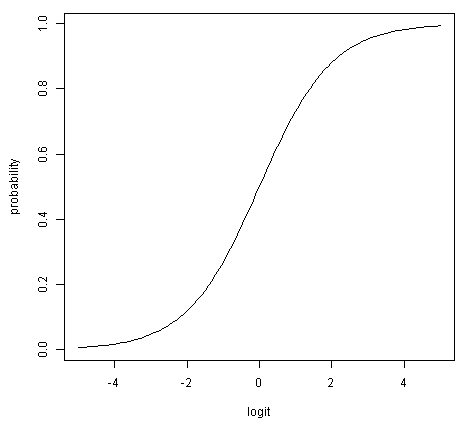

# 로짓(Logit) 이란?

## 먼저, 오즈(odds)
odds는 실패비율 대비 성공비율을 설명하는 것.

어떤 이벤트가 15번 시행 중 5번 성공했을 때, 성공 비율은 $\frac{5}{15}$이고 실패 비율은 $\frac{10}{15}$이다. 이때 오즈는:
$$ \frac{\frac{5}{15}}{\frac{10}{15}} = \frac{5}{10}$$

같은 식으로, 확률 p에 대한 오즈는 다음과 같이 정의된다:

$$\frac {p}{1-p}$$

## 로짓
확률 p의 로짓 L은 다음과 같이 정의된다:

$$ L = ln \frac {p}{1-p} $$

즉, 오즈에 자연로그를 씌운 것. 로짓(logit)은 log + odds에서 나온 말.

오즈는 그 값이 1보다 큰지가 결정의 기준이고, 로짓은 0보다 큰지가 결정의 기준.

이것의 역함수는:

$$p = \frac{1}{1+e^{-L}}$$

아래 위로 $e^{-L}$을 곱해주면 아래와 같이 시그모이드 함수로 나온다:

$$p = \frac{e^{-L}}{e^{-L}+1}$$

확률의 범위는 $[0, 1]$ 이나, 로짓의 범위는 $[-\infty, \infty ]$이다.

아래 그림은 확률과 로짓의 비선형 관계를 보여줌:

## 로짓의 필요성: 데이터를 두 그룹으로 분류하는 문제

기본적인 방법은 로지스틱 회귀분석으로, 종속변수 y가 0 또는 1을 갖기에, 단순 선형 함수 $y=wx+b$로는 풀기가 힘들다(입력값이 커지면 출력값의 해석이 곤란).

확률 p의 범위는 $[0, 1]$, Odds(p)의 범위는 $[0, \infty]$, log(Odds(p))는 $[-\infty, \infty]$가 되어, 다음과 같은 형태로는 선형분석이 가능하다.

$$log(Odds(p)) = wx + b$$

위의 식을 잘 설명하는 시그모이드 함수의 w와 b를 찾는 문제로 바꾼다.

## 참고 링크
* https://stats.stackexchange.com/questions/52825/what-does-the-logit-value-actually-mean
* https://icim.nims.re.kr/post/easyMath/64
